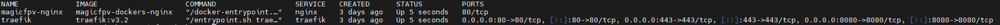

# Wdrożenie 

Wdrożenie strony poprzez dwa dockery z nginx oiraz treafikiem może przynieść parę problemów związanych z wersją dockera zainstalowanego na dockerze wraz z treafikiem. Może to porawdzić do błędów związanych z API.

## Struktura projektu

```
projekt/    # Główny katalog
├── docker-compose.yml   # Plik konfiguracyjny
├── traefik/ # Katalog konfiguracyjny traefika
|   ├── Dockerfile  # Plik konfiguracyjny
|   ├── acme.json   #Plik przetrzymujący certyfikaty SSL strony
|   ├── dynamic/
|   │   └── nginx.yml   # Konfiguracja reverse proxy na nginx
|   └── traefik.yml #Plik konfiguracyjny traefika 
|
└── website/  # Katalog strony internetowej oraz pliku konfiguracyjnego dockera
    ├── Dockerfile # Plik konfiguracyjny dockera
    └── html/   # Pliki oraz foldery strony internetowej
       └── index.html 
```

### [docker-compose.yml](./docker-compose.yml)

[**Linie 7-10**](./docker-compose.yml#L7): Definicja portów na których ma nasłuchiwać traefik.
```yaml
    ports: 
      - "80:80" #PORT HTTP
      - "443:443" #PORT HTTPS
      - "8080:8080" #PORT TRAEFIK
```
[**Linia 17**](./docker-compose.yml#L17) oraz [**linia 24**](./docker-compose.yml#L24): Ustawienie automatycznego startu dockerów.

### [Dockerfile-nginx](./website/Dockerfile)
[**Linia 1**](./website/Dockerfile#L1): Definicja obrazu dockera (**nginx:alpine** lekki obraz nginx).
[**Linia 2**](./website/Dockerfile#L2): Skopiowanie plików strony do katalogu dockera odpowiedzialnego za strone internetową.
[**Linia 3**](./website/DockerfileL3): Definicja portu który nasłuchuje nginx (W sieci dockerowej!!!).

### [Pliki strony](./website/html/)
**W tym katalogu powinny znajdować się pliki oraz katalogi strony takie jak index.html, style.css, script.js itp.**

### [Dockerfile-traefik](./traefik/Dockerfile)
[**Linia 1**](./traefik/Dockerfile#L1): Definicja obrazu dockera traefik.
[**Linie 4-10**](./traefik/Dockerfile#L4): Odinstalowanie oraz zainstalowanie nowego dockera aby wyeliminować błąd z wersją API.

### [acme.json](./traefik/acme.json)
**Plik powinien być pusty (tam będą zapisywanie certyfikaty SSL)**

### [traefik.yml](./traefik/traefik.yml)
**Plik przechowujący konfiguracje traefika**
[Plik konfiguracyjny w pliku](./traefik/traefik.yml)

### [./dynamic/nginx.yml](./traefik/dynamic/nginx.yml)
**Konfiguracja przeniesienia ruchu z traefika na nginx**

## Komendy do wystartowania dockerów
```bash
cd /sciezka/do/projektu
docker compose up -d
docker ps
```
Wynik:
